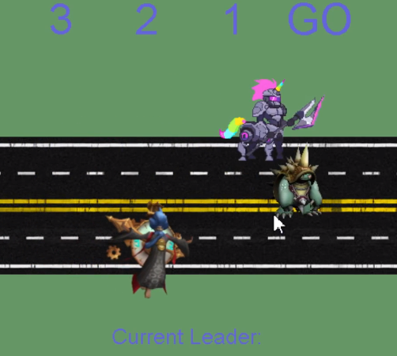

This was my first ICS 111 coding project that really got me interested in ICS. The goal of this game is click keys "A" and "D" (A and then D or D and then A, not at the same time) as fast as possible to move across the screen. The game starts as I hear the announcer start the countdown, the "leader" will be updated once a new leader has taken first place. 
 
<a href="https://github.com/collinhw/Project1">Source</a>.
