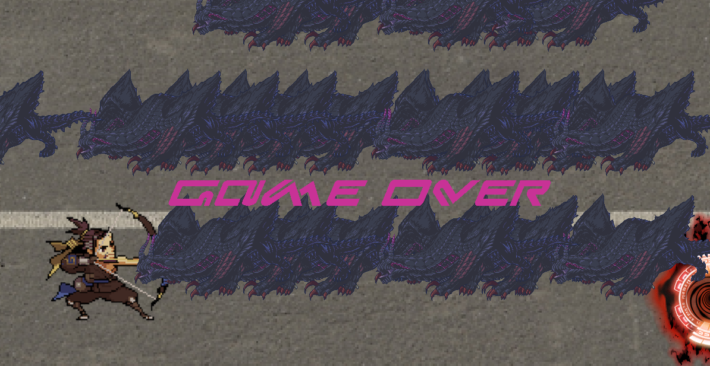

  

My ICS 111 final exam was a group project where we would have to work in teams of two or three to develop a game or a 60 second animation. Each group member would work on at least one class. My partner and I decided to split the work between character functions and monster functions. I wrote the monster class and the decision class, while my partner wrote the hero class. I had to make sure that I could control the amount of monsters spawned and how they spawned. We wanted the main controls to be WASD so the monsters should spawn from right to left as the hero needs to get to the bottom right corner. I had to make sure that the hitboxes were also fair in comparison of the character model. The hitboxes is a square for both the hero and the monster itself, so if they were to overlap the hero would lose a heart and give out an "oww" sound. I also had to make sure that the monsters will keep spawning even after they have left the page. The count of monsters will only decrease if the bullet hitbox hits the monster hitbox. Which means that the monster has to disappear after it's hitbox detects the bullet.

This game is a side to side shooting game where your character is based off on Overwatch characters trying to eliminate a monster. 
The goal of this game is to eliminate "X" amount of monsters to reach the portal to secure your victory. The character has four hearts of life, if your character model touches the monster you lose one heart. You would use 'WASD" keys to move and 'P' to shoot.

<a href="https://github.com/collinhw/Project3">Source</a>

