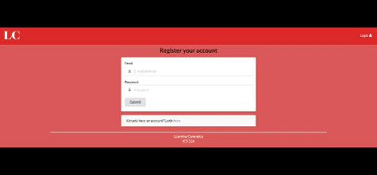

My ICS 314 final project is a meteor based web application that allows my target audience (UH
Manoa ICS community) to come together as struggling college students looking for others who
are having a tough time in a particular class. Coming into the ICS department without having
any prior knowledge of discrete mathematics or Java can be a really big blow as you would be
steps behind the students who already have a proficient coding background. Making friends
during your first semester in college can be difficult as well unless you have decent social skills.
This aspect is not taught in high school or college, it is an experience that one has to go through
and by using this web app they are able to connect with others who have the same interests
and issues they do. Studying and learning the rigorous material on your own is difficult if one
does not have a good foundation of basic course concepts. This web application is used to
alleviate that issue by coordinating study groups for students to participate in.

My duties for this project were the user profile pages and the study session pages. I had to
create a separate database where a user will login into their account and not interfere with
listing additional profiles. This is because it was a layout for the UH CAS system that will be
implemented later. For the list profile page, I implemented the drop-down image hider and the
tags for their listed courses. I wanted users to be able to quickly create an account and set up a
user profile and begin to browse the currently available study sessions. Their user profile would
consist of their class standing and specified courses that they wish to pursue help in.

  

During the course of the entire project, my team ran in to many merge conflicts as it was the first
time for us to do a group project using GitHub. Eventually, two of us ran into some issues using
Github Desktop so we had to use git. Learning git was a valuable experience for me and I only
knows the very basics of git. Later in my college career, I wish to become more proficient at
working with smaller scale projects with two to three group members. I also got more experience
with deadlines. So far in my college career, I have been punctual on my homework, reports,
attendance, etc. Having a strict project deadline means I have to properly communicate with my
group members about their designated assignments. I had to go out of my way to gather the
three of us in one room as we had many schedule conflicts. In the end, we were able to get it
together without having more conflicts.

<a href="https://github.com/collinhw/Project3">Source</a>
