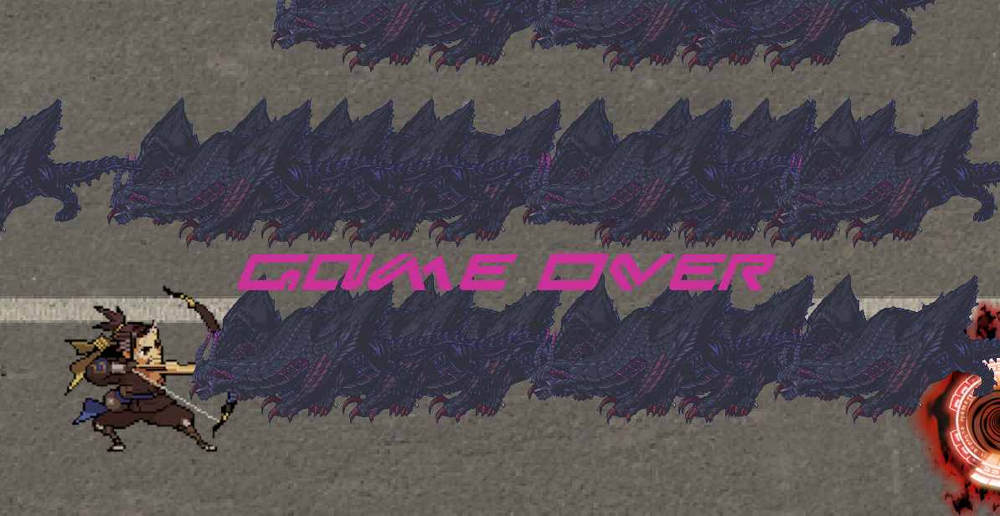

  

My ICS 111 final exam was a group project where we would have to work in teams of two or three to develop a game or a 60 second animation. This game is a side to side shooting game where your character is based off on Overwatch characters trying to eliminate a monster. 

The goal of this game is to eliminate "X" amount of monsters to reach the portal to secure your victory. The character has four hearts of life, if your character model touches the monster you lose one heart. You would use 'WASD" keys to move and 'P' to shoot.

